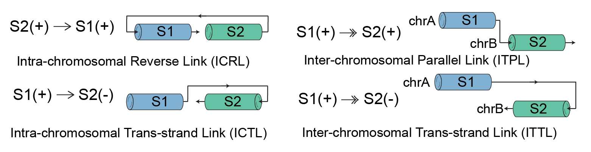

# ScanNCLT: A powerful tool for detecting non-co-linear transcripts (NCLTs) with long reads and transcript segment graphs

[][pypi]


<!-- [][paper]
[paper]: https://www.nature.com/articles/d41586-023-03067-6
-->

## What is ScanNCLT?

ScanNCLT is a non-co-linear transcript caller for third-generation sequencing reads.
It is able to detect and classify the non-co-linear transcripts with the following four forms of non-co-linear segment links: ICRL, ICTL, ITPL, and ITTL (see the figure below).

<div align="center">

</div>

## Prerequisite

`htslib` is required to run ScanNCLT. Please install it in the environment.

```bash
   conda install -c bioconda htslib
```

## 🚀 **Getting Started**

The first step in starting your journey with `ScanNCLT` is to install the tool.
To do this, there are two options shown below:

- **PyPI**

```bash
pip install scannclt
```

- **CONDA** via [Bioconda](https://bioconda.github.io/)

```bash
conda install scannclt
```

Congratulations! You've successfully installed `ScanNCLT` on your local machine.
If you have some issues, please check the [document](https://scannclt.readthedocs.io/en/latest/installation.html) first before opening an issue.

### 🤖 **Using ScanNLS**

```console
❯ scannclt -h

usage: scannclt [-h] [--version] --input INPUT --ref REF --gtf GTF --output OUTPUT [--output-seq {consensus,reference,both}] [--sr SUPPORT_READS]
               [--splice-bin SPLICE_BIN] [--mapq MAPQ] [--log-level {info,debug,trace,warning}] [--parallel PARALLEL] [--aligner {blat,}]
               [--blat-identity IDENT_CUTOFF] [--blat-2bit BLAT_TWO_BIT] [--blat-nclosed] [--blat-nsleep] [--blat-port BLAT_PORT] [--species {human,mouse}]
               [--circular-rna-filter {remove,keep,extract}] [--off-exon-filter] [--rt-switching-filter RT_SWITCHING_FILTER_LEN] [--ncan] [--graph] [--refine]
               [--nbound] [--max-allowed-nm MAX_ALLOWED_NM] [--max-allowed-ins MAX_ALLOWED_INS] [--min-required-ins MIN_REQUIRED_INS] [--long-indel-length LONG_INDEL_LENGTH]
               [--indel-fraction INDEL_FRACTION] [--prune-threshold PRUNE_THRESHOLD] [--soft-len SOFT_LEN]
               [--mismatch MISMATCH] [--min-soft-seg-len MIN_SOFT_SEG_LEN] [--alignment-fraction ALIGNMENT_FRACTION]
               [--substitution-fraction SUBSTITUTIONS_FRACTION] [--ignore-circle] [--rescue-sr]

scannclt 🚀 Non-co-linear transcript identification using transcriptomic long reads data

options:
  -h, --help                              show this help message and exit
  --version                               show program's version number and exit
  --input INPUT                           input BAM file
  --ref REF                               reference genome in FASTA format (with fai index)
  --gtf GTF                               gene annotations in GTF format
  --output OUTPUT                         output prefix
  --output-seq {consensus,reference,both}
                                          output sequence type (default: consensus)
  --sr SUPPORT_READS                      minimum number of support reads for reporting NCLT (default: 1)
  --splice-bin SPLICE_BIN                 splice site bin size (default: 5)
  --mapq MAPQ                             minimum MAPQ of reads for calling NCLT (default: 20)
  --log-level {info,debug,trace,warning}  set log level (default: warning)
  --thread THREAD                         set the thread number (default: 1)
  --aligner {blat,}                       aligner to use for mapping reads (default: None)
  --blat-identity IDENT_CUTOFF            BLAT identity cutoff (default: 0.9)
  --blat-2bit BLAT_TWO_BIT                reference genome in 2bit format for blat aligner
  --blat-nclosed                          close BLAT server when job has done (default: True)
  --blat-nsleep                           if sleep randomly before starting BLAT server (default: True)
  --blat-port BLAT_PORT                   port for BLAT server (default: 88888)
  --species {human,mouse}                 species name for reference genome (default: human)
  --circular-rna-filter {remove,keep,extract}
                                          the way of dealing with circular RNAs (default: remove)
  --off-exon-filter                       turn on exon filter (default: True)
  --rt-switching-filter RT_SWITCHING_FILTER_LEN
                                          set RT switching filter (default length: 10)
  --ncan                                  considering Non-canonical spliced sites (default: False)
  --graph                                 if output graph (default: False)
  --refine                                if refine the graph (default: False)
  --nbound                                if add maximum increment limit using average reads depth when rescuing sr (default: True)
  --max-allowed-nm MAX_ALLOWED_NM         maximum allowed NM to keep AS tag (default: 50)
  --max-allowed-ins MAX_ALLOWED_INS       maximum allowed micro-insertion length (default: 50)
  --min-required-ins MIN_REQUIRED_INS     minimum required insertion length in read (default: 100)
  --long-indel-length LONG_INDEL_LENGTH   the length cutoff of defining long indel in the reads (default: 10)
  --indel-fraction INDEL_FRACTION         the allowed maximum long indel fraction in the reads (default: 0.001)
  --prune-threshold PRUNE_THRESHOLD       splice graph pruning length threshold (default: 10)
  --soft-len SOFT_LEN                     minimum softclipped segment length to be rescued (default: 5)
  --mismatch MISMATCH                     maximum allowed mismatch bases of rescued segment (default: 3)
  --min-soft-seg-len MIN_SOFT_SEG_LEN     minimum softclipped segment length to trigger BLAT alignment (default: 200)
  --alignment-fraction ALIGNMENT_FRACTION
                                          minimal fraction of aligned part for Smith-Waterman local alignment (default: 0.8)
  --substitution-fraction SUBSTITUTIONS_FRACTION
                                          the allowed maximum substitution fraction in the reads (default: 0.05)
  --ignore-circle                         if export result if the nlgraph has a circle (default: False)
  --rescue-sr                             if rescuing sr for edge (default: False)

```

Please refer to the [document](https://scannclt.readthedocs.io/en/latest/) for details and more examples.

## 📎 **Citation**

Feel free to read and cite our paper in [BioRvix](https://www.biorxiv.org/).

## Contributing

Contributions are very welcome. To learn more, see the [Contributor Guide].

## 🪪 **License**

The project is licensed under the GNU General Public License.

## 🤝 **Contact**

If you experience any problems or have suggestions, please create an issue or a pull request.

## Credits

[mit license]: https://opensource.org/licenses/mit
[pypi]: https://pypi.org/
[hypermodern python cookiecutter]: https://github.com/cjolowicz/cookiecutter-hypermodern-python
[file an issue]: https://github.com/ylab-hi/ScanNCLT/issues
[pip]: https://pip.pypa.io/
[contributor guide]: CONTRIBUTING.md
[command-line reference]: https://scannclt.readthedocs.io/en/latest/usage.html
